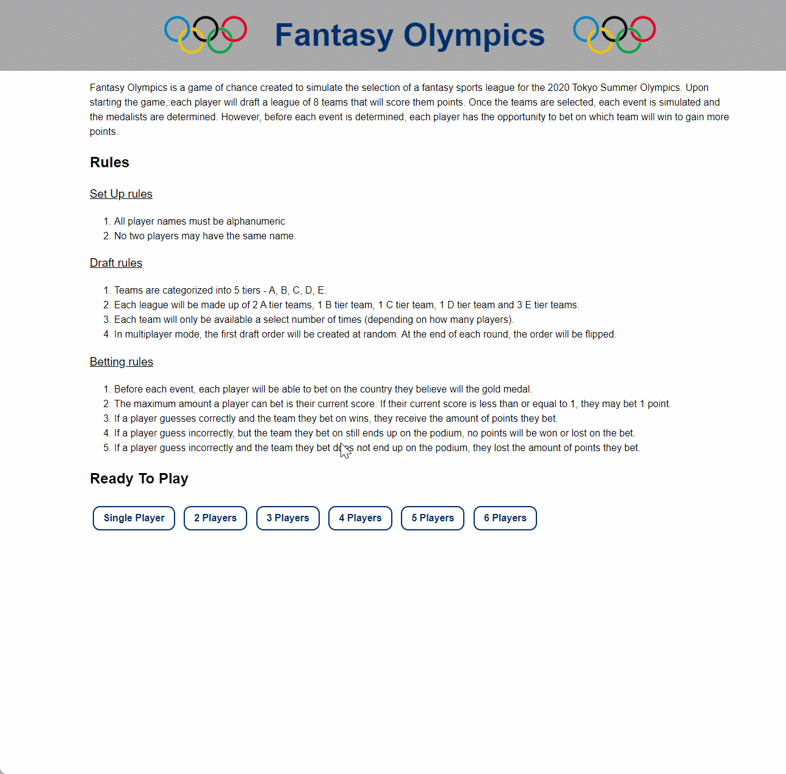
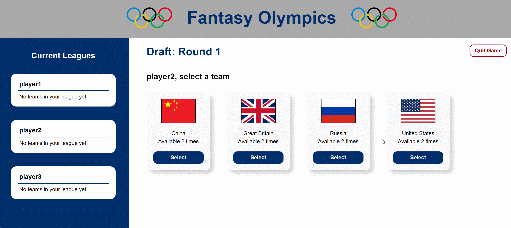
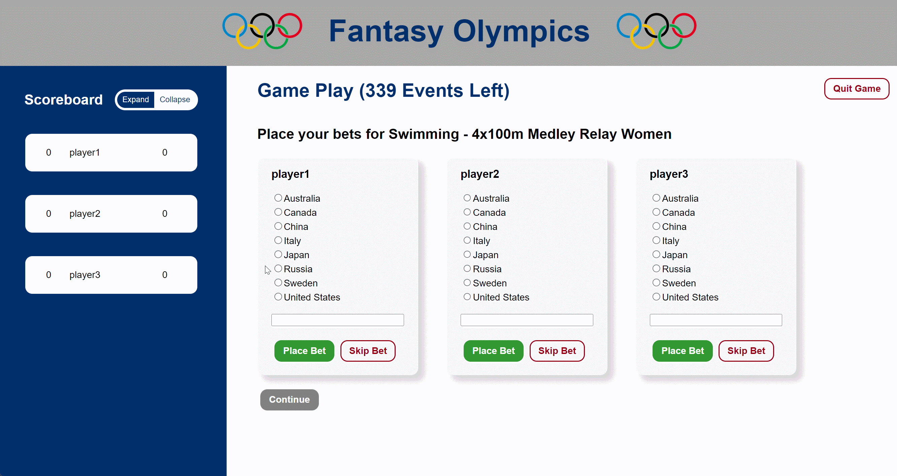
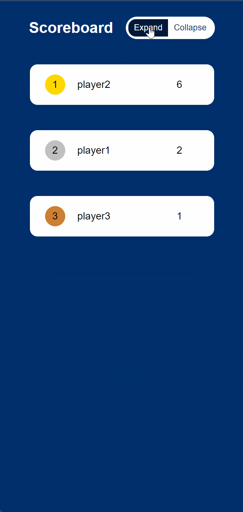

# fantasy-olympics-hci584

## Project Overview

&nbsp; &nbsp; &nbsp; &nbsp;Fantasy Olympics is a game of chance created to simulate the selection of a fantasy sports league for the 2020 Tokyo Summer Olympics. Upon starting the game, each player will draft a league of 8 teams that will score them points. Once the teams are selected, each event is simulated and the medalists are determined. However, before each event is determined, each player has the opportunity to bet on which team will win to gain more points.

Fantasy Olympics is a game of chance created to simulate the selection of a fantasy sports league for the 2020 Summer Olympic Games and uses historical data to determine a potential outcome for each event (note: this outcome is not necessarily what happened in the actual 2020 Tokyo games). This historical data was pulled from the 2008 - 2016 Summer Olympics and the teams are categorized into 5 tiers - A, B, C, D, E - with A-tier being teams with historically highest medal scores and E-tier being teams with historically lowest medal scores from the Summer Olympics. A countries medal score is calculated as follows: 3 points for each gold medal, 2 points for each silver medal, 1 point for each bronze medal. To ensure that each player selects a range of teams (and not just powerhouse teams that historically sweep the medal tables), the teams. In order to play, a player selects a league of 8 countries that will earn them points based on the medals that team earns in game. From there, the game is kicked off and the in game simulation begins for each event.

&nbsp; &nbsp; &nbsp; &nbsp;From a more technical perspective, Version 1 plays the game using the command line interface that allows for users to input their team selections and print out the scoreboard to show where they are currently in the rankings as the game continues. By the end of the version 2 code lock, a front end will be created that would ideally  create a more visually interesting and engaging front end that would allow for a form to submit their data and then visually display a tabular scoreboard that lists the player’s name, country selections and scores. I would ideally like to see if I could shift it to Flask or Django framework to create a sleeker/modern UI since Tkinter is a bit older and dated looking.

## Game Rules
1. All player names must be alphanumeric and no two players may have the same name. 
2. Drafting Rules
   - Each person will create a league of 8 teams of the following composition: 2 A-tier teams, 1 B-tier team, 1 C-tier team, 1 D-tier team, and 3 E-tier teams.
   - If the game is being played in multiplayer mode, a team may only be chosen by a certain number of players. The number of times a team is available depends on the number of players and the number of teams available in a tier.
   - For the first round of drafting, the players will be selected at random to select a team. The order will be flipped in each proceeding round (i.e. odd number rounds will have the same order; even number rounds will have the same order).
3. Scoring
   - A player receives 3 points for each gold medal a team in their league wins.
   - A player receives 2 points for each silver medal a team in their league wins.
   - A player receives 1 point for each bronze medal a team in their league wins.
4. Betting
   - If a player doesn't have a chance of winning a medal (i.e. none of the participants in the event are in their league), they will have the choice to bet on who will win the gold medal.
   - If the player guesses the winner correctly, they will receive 1 point.
   - If the player doesn't guess the winner correctly but their guess ends up with a medal, they will receive 0 points.
   - If the player doesn't guess the winner and their guess fails to medal, they will lose 1 point.

## Set Up, How To Run & Packages
Beyond Python, the project currently requires you to install Pandas. To do this, run

	pip install pandas
 	pip install Flask
  	pip install Flask-CacheControl
   	pip install numpy

To run the program, in the project directory in the terminal run the following command:
 
 	set FLASK_APP app.py 
  	flask run

The program call also be run using in debug mode the optional debug flag:

	flask run --debug

## User Activity Flow
The first task is the players selecting the number of people will people playing their game. They can complete this task by clicking the button associated with the number of people playing, entering their names in the text field and clicking confirm players as shown in the gif below.

Once they have confirmed the number of players, the draft process begins as shown in the gif below. In this process, each player will select 8 teams based on the draft rules defined above. When it's their turn, they will simply click the select button the team they would like to select on the list of those available. Once they selected the team, it will appear in their league on the left side of the screen to keep track of which teams each player has selected. This will continue until all 8 rounds of the draft have been completed.

Once all 8 rounds of the draft are complete, the main game play begins. At this point, as shown in the gif below, the players will be able to bet on who they think the winner of the upcoming event will be based on the betting rules above or skip the betting process for that event. Once everyone has made a decision regarding their bet, the player will click the now enabled continue button to simulate that event.

As shown in the final gif below, the scoreboard has a collapsed and expanded view. In the collapsed view, it merely shows each players rank and score. When in the expanded view, however, it shows a breakdown of how their total score has been tabulated based on the total score for each team as well as how many points they have won (or lost) by making bets.

## Known Issues
The only known issues are as follows:

1. Player names must be alphanumeric. This was due to a bug discovered that I didn't have enough time to research and remediate. This, however, is accounted for on the frontend in a hot-fix to check to ensure all names are alphanumeric.

2. If you reload the main game play screen after someone places a bet in multiplayer mode, it resets and allows a player to redo their bet. This is a bug I didn't have enough to research and remediate. Please do not refresh the page once you hit the main play screen to avoid this glitch.
